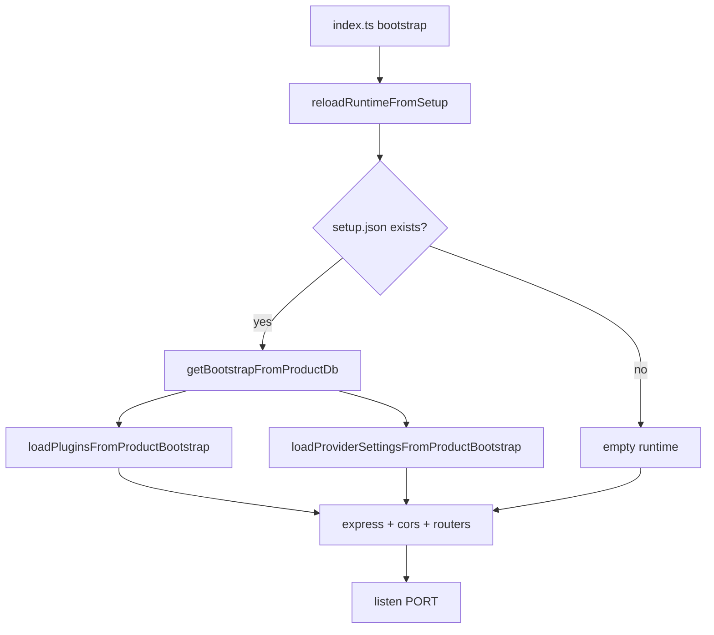
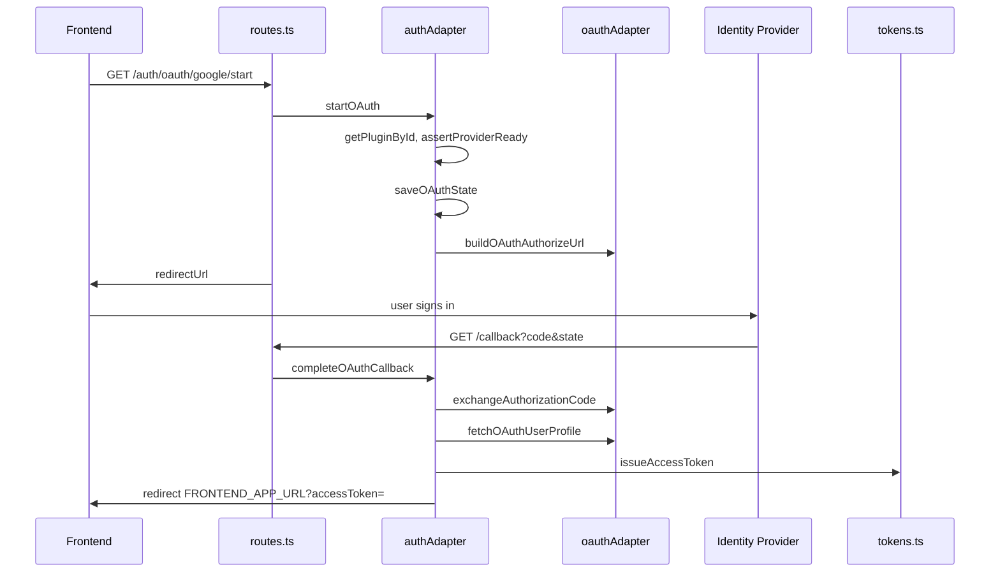

# Auth Microservice A → Z

Complete map of the **auth microservice prototype**: from adding a plugin in `/setup` through OAuth/password login, product DB integration, and tokens. Every section lists **where the code lives (file + line range)**.

Companion doc for user journeys: [REGISTER_TO_LOGIN_FLOW.md](./REGISTER_TO_LOGIN_FLOW.md).

---

## 1. High-level architecture

```text
┌─────────────────────────────────────────────────────────────────┐
│                    auth-microservice-prototype                     │
│  index.ts → routes + productAuthRoutes + setupRoutes + cors      │
│                                                                  │
│  In-memory runtime (loaded from product DB on boot):             │
│    pluginRegistry  +  providerSettings (Map)                     │
│                                                                  │
│  Product DB (via setup.databaseUrl):                             │
│    auth_provider_plugins, auth_provider_settings, users          │
│                                                                  │
│  Local file: .runtime/setup.json (connection + secrets)          │
└─────────────────────────────────────────────────────────────────┘
```

| Concern | Storage |
|---------|---------|
| Connection, pepper, JWT secret, CORS | `.runtime/setup.json` |
| Plugin manifests + provider credentials | Product PostgreSQL |
| User passwords | Product `users` table |
| OAuth state (CSRF) | In-memory (`oauthStateStore`) |
| Plugin list at runtime | In-memory Map (`pluginRegistry`) |

---

## 2. Boot sequence



| Step | File | Lines |
|------|------|-------|
| Entry | `src/index.ts` | 9–39 |
| Reload from DB | `src/runtimeSync.ts` | 6–12 |
| Read setup file | `src/setupStore.ts` | 13–21 |
| Bootstrap query | `src/productDbConfig.ts` | 124–152 |
| Load plugins to memory | `src/plugin/pluginRegistry.ts` | 54–83 |
| Load provider rows to memory | `src/providerSettings.ts` | 407–428 |
| Config / env | `src/config.ts` | 8–17 |
| CORS | `src/cors.ts` | 9–30 |

---

## 3. Configuration

### 3.1 Environment (`.env`)

| Variable | Purpose | Code |
|----------|---------|------|
| `PORT` | HTTP port (default 5600) | `config.ts` **9** |
| `JWT_SECRET` | Auth-service OAuth tokens | `config.ts` **6, 10** |
| `OAUTH_CALLBACK_BASE_URL` | OAuth redirect base + public URL | `config.ts` **11–14**, `oauthRedirectUri.ts` **6–7** |
| `FRONTEND_APP_URL` | Where OAuth sends user after login | `oauthAdapter.ts` (getFrontendOAuthCompleteUrl) |
| `TOKEN_TTL_SECONDS` | Auth-service token lifetime | `config.ts` **15** |
| `OAUTH_PROTOTYPE_MODE` | Fake OAuth without real IdP | `oauthAdapter.ts` (isOAuthPrototypeMode) |

### 3.2 Setup file (`.runtime/setup.json`)

Written by `/setup` UI.

| Field | Purpose | Code |
|-------|---------|------|
| `databaseUrl` | Product PostgreSQL | `setupStore.ts` **4–18** |
| `companyId` | Tenant filter for users + auth tables | same |
| `passwordPepper` | Password hashing | same |
| `productJwtSecret` | Product API JWT signing | same |
| `productJwtExpiresIn` | e.g. `7d` | `productJwt.ts` **91–101** |
| `allowedOrigins` | CORS for browser → service | `cors.ts` **4–21** |

---

## 4. Setup UI (`/setup`) — admin A → Z

### 4.1 HTML page

| Piece | File | Lines |
|-------|------|-------|
| Setup page HTML + JS | `src/setupRoutes.ts` | 18–163 (approx.) |
| Serve page | `setupRoutes.ts` | **165–167** |

### 4.2 Step 1 — Product connection

| Action | HTTP | Handler | Lines |
|--------|------|---------|-------|
| Test DB | `POST /setup/connection/test` | `setupRoutes.ts` | **209–221** |
| Save config | `POST /setup/connection/save` | `setupRoutes.ts` | **224–258** |
| Read state | `GET /setup/state` | `setupRoutes.ts` | **179–190** |

**What save does:**

1. `testProductConnection` — `productDbConfig.ts` **24–32**
2. `ensureAuthSetupTables` — `productDbConfig.ts` **35–122**
3. `writeSetupConfig` — `setupStore.ts` **24–27**
4. `reloadRuntimeFromSetup` — `runtimeSync.ts` **6–12**

### 4.3 Step 2 — Providers & plugins

| Action | HTTP | Lines |
|--------|------|-------|
| List providers | `GET /setup/providers` | `setupRoutes.ts` **261–286** |
| Save provider | `PUT /setup/providers/:provider` | `setupRoutes.ts` **288–327** |
| Upload plugin JSON | `POST /setup/plugins/upload` | `setupRoutes.ts` **329–371** |
| Delete plugin | `DELETE /setup/plugins/:id` | `setupRoutes.ts` **323–337** |
| Force reload | `POST /setup/reload` | `setupRoutes.ts` **339–342** |

**Upload plugin flow:**

```text
multipart file → parsePluginUpload → validate manifest
  → INSERT auth_provider_plugins (product DB)
  → INSERT auth_provider_settings row (disabled)
  → reloadRuntimeFromSetup
```

| Step | File | Lines |
|------|------|-------|
| Parse upload | `plugin/manifestParser.ts` | (parse function) |
| Validate schema | `plugin/manifestSchema.ts` | validatePluginManifest |
| DB insert | `setupRoutes.ts` | **337–365** |
| Reload | `runtimeSync.ts` | **6–12** |

Example plugin JSON: `plugins/examples/entra.plugin.json` (repo root under auth-microservice-prototype).

---

## 5. Plugin system

### 5.1 Manifest types

| Type | Used for | Schema |
|------|----------|--------|
| `oauth` | Google, Entra, custom IdP | `plugin/manifestSchema.ts` |
| `passkey` | WebAuthn | same |

### 5.2 In-memory registry

| Function | File | Lines |
|----------|------|-------|
| `listPlugins` | `plugin/pluginRegistry.ts` | 17–18 |
| `getPluginById` | same | 21–22 |
| `registerPlugin` | same | 29–47 |
| `deletePlugin` | same | 50–51 |
| `loadPluginsFromProductBootstrap` | same | 54–83 |

### 5.3 OAuth redirect URI

Auto-computed per plugin:

```text
{OAUTH_CALLBACK_BASE_URL}/auth/oauth/{pluginId}/callback
```

| Code | File | Lines |
|------|------|-------|
| `resolvePluginRedirectUri` | `plugin/oauthRedirectUri.ts` | 5–8 |

Used in setup UI, provider `extra_config.redirectUri`, and OAuth token exchange.

---

## 6. Provider settings (runtime)

In-memory map: `settingsByProvider` in `providerSettings.ts` **124**.

| Function | Purpose | Lines |
|----------|---------|-------|
| `getAllProviderSettings` | Admin list (all providers) | **218–281** |
| `getPublicAuthOptions` | Sign-in page (enabled only) | **288–298** |
| `getProviderSetting` | Single provider + secrets | **300–319** |
| `assertProviderReady` | Before OAuth start | (search in file) |
| `upsertProviderSetting` | Admin/update | **320+** |
| `isProviderReady` | OAuth needs client id/secret | **113–117** |
| `loadProviderSettingsFromProductBootstrap` | Boot from DB | **407–428** |
| Built-in `password` provider | `BUILTIN_PASSWORD_PROVIDER` | **6** |

**Public sign-in list** → `GET /auth/providers` → `routes.ts` **41–47** → `getPublicAuthOptions`.

---

## 7. HTTP routes map

### 7.1 Public auth (end users)

| Method | Path | Handler | File:Lines |
|--------|------|---------|------------|
| GET | `/health` | health | `routes.ts` 37–38 |
| GET | `/auth/providers` | provider list | `routes.ts` 41–47 |
| POST | `/auth/login` | product password login | `routes.ts` 56–85 |
| POST | `/auth/register` | product register | `routes.ts` 87–124 |
| GET | `/auth/oauth/:provider/start` | OAuth start | `routes.ts` 127–149 |
| GET | `/auth/oauth/:provider/callback` | OAuth callback | `routes.ts` 242–258 |
| GET | `/auth/me` | auth-service token introspection | `routes.ts` 50–52, `middleware.ts` 7–19 |

### 7.2 Product auth API (minimal integration)

Mounted at `/auth/product` in `index.ts` **18**.

| Method | Path | Purpose | File:Lines |
|--------|------|---------|------------|
| GET | `/auth/product/config` | Public integration config | `productAuthRoutes.ts` 22–45 |
| GET | `/auth/product/providers` | Same as providers | 48–55 |
| POST | `/auth/product/login` | Password login + product JWT | 57–72 |
| POST | `/auth/product/register` | Register + product JWT | 75–96 |
| POST | `/auth/product/oauth/complete` | OAuth token → product JWT | 99–126 |

### 7.3 Passkey (plugin type)

| Method | Path | File:Lines |
|--------|------|------------|
| POST | `/auth/:provider/passkey/login/options` | `routes.ts` 152–163 |
| POST | `/auth/:provider/passkey/login/verify` | `routes.ts` 166–186 |
| POST | `/auth/:provider/passkey/register/options` | `routes.ts` 189–201 |
| POST | `/auth/:provider/passkey/register/verify` | `routes.ts` 204–225 |

Implementation: `auth/passkeyAdapter.ts`.

### 7.4 Admin (Bearer auth-service token)

| Method | Path | Lines |
|--------|------|-------|
| GET | `/auth/admin/providers` | `routes.ts` 261–267 |
| PUT | `/auth/admin/providers/:provider` | `routes.ts` 283–302 |
| GET/POST/DELETE | `/auth/admin/plugins*` | `routes.ts` 305–347 |

### 7.5 Internal (product backend automation)

| Method | Path | Lines |
|--------|------|-------|
| GET/PUT | `/internal/auth/settings/providers*` | `routes.ts` 350–381 |
| GET/POST/DELETE | `/internal/auth/plugins*` | `routes.ts` 384–430 |

---

## 8. OAuth flow (detailed)



| Step | File | Lines |
|------|------|-------|
| Start | `auth/authAdapter.ts` | 27–62 |
| OAuth state | `auth/oauthStateStore.ts` | save / consume |
| Authorize URL | `auth/oauthAdapter.ts` | 35–54 |
| Callback route | `routes.ts` | 242–258 |
| Complete | `auth/authAdapter.ts` | 65–109 |
| Code → token | `auth/oauthAdapter.ts` | 57–111 |
| Userinfo | `auth/oauthAdapter.ts` | 137–158 |
| Map profile | `auth/oauthAdapter.ts` | 160–180 |
| Issue auth token | `auth/authAdapter.ts` | 94–99 |

---

## 9. Password / product user auth

Handled against **product `users` table** (not auth-service DB).

| Function | File | Lines |
|----------|------|-------|
| `hashClientHashedPassword` | `productPassword.ts` | 3–11 |
| `compareClientHashedPassword` | `productPassword.ts` | 14–25 |
| `createProductUser` | `productUserAuth.ts` | 80–122 |
| `loginProductUser` | `productUserAuth.ts` | 56–77 |
| `findProductUserByEmail` | `productUserAuth.ts` | 36–54 |
| `requireSetup` | `productUserAuth.ts` | 17–30 |

---

## 10. Two token types (important)

### 10.1 Auth-service token (OAuth interim)

Used after IdP login, before product session.

| | |
|--|--|
| Format | 2 parts: `base64url(payload).signature` |
| Secret | `JWT_SECRET` / `config.tokenSecret` |
| Claims | `sub`, `email`, `name`, `provider` |
| Issue | `tokens.ts` **28–37** |
| Verify | `tokens.ts` **40–64** |
| Middleware | `middleware.ts` **7–19** |

### 10.2 Product JWT (API access)

Used for `Authorization: Bearer` on product backend.

| | |
|--|--|
| Format | Standard JWT (header.payload.signature), HS256 |
| Secret | `productJwtSecret` from setup (= product `JWT_SECRET`) |
| Claims | `userId`, `companyId`, `email`, `role`, `iat`, `exp` |
| Issue | `productJwt.ts` **20–31**, **64–88** |
| Verify (product) | `poms-backend/src/utils/jwt.ts` **41–46** |

**Exchange OAuth → product JWT:** `productAuthRoutes.ts` **99–126**.

---

## 11. Product database tables

### 11.1 Auth setup tables (migration)

Source SQL: `poms-backend/scripts/migrations/002-auth-setup.sql`

Created/upgraded by: `productDbConfig.ts` **35–122**

| Table | Purpose |
|-------|---------|
| `auth_provider_plugins` | Plugin JSON manifests per company |
| `auth_provider_settings` | enabled, client_id, client_secret, extra_config |

Bootstrap seed password row: `productDbConfig.ts` **131–137**

### 11.2 Users (product app)

| Column | Purpose |
|--------|---------|
| `id` | UUID; also password **salt** |
| `company_id` | Tenant from setup |
| `email` | Login identifier |
| `password` | `finalHash` (64-char hex) |
| `role`, `is_active` | Authorization |

Entity reference: `poms-backend/src/entities/User.ts`

---

## 12. CORS (browser → auth service)

| File | Lines |
|------|-------|
| `cors.ts` | 9–30 |
| Applied in | `index.ts` **14** |

Allows frontend origins listed in setup `allowedOrigins`. Empty list = permissive in dev (`cors.ts` **16**).

---

## 13. Error handling

| Layer | File | Lines |
|-------|------|-------|
| Global Express handler | `index.ts` | 23–26 |
| Route try/catch | various `next(error)` | — |

---

## 14. POMS integration (this monorepo)

The auth service is **generic**; POMS wires it as follows:

| Piece | Location |
|-------|----------|
| Proxy OAuth/providers | `poms-backend/src/controllers/auth.controller.ts` |
| Auth service HTTP client | `poms-backend/src/services/authMicroserviceClient.ts` |
| Config `AUTH_SERVICE_URL` | `poms-backend/src/config/authService.ts` |
| Frontend sign-in | `poms-frontend/src/components/auth/SignInForm.tsx` |
| OAuth callback | `poms-frontend/src/components/auth/OAuthCallbackHandler.tsx` |
| Client hash | `poms-frontend/src/utils/sha256.ts` |
| Auth setup tab (optional) | `poms-frontend/src/components/settings/AuthSetupTab.tsx` |

POMS can migrate to **minimal mode** by pointing `authApi.ts` at auth-service URLs (`/auth/product/*`) instead of `/api/auth/*`.

---

## 15. Complete source file index

| File | Responsibility |
|------|----------------|
| `src/index.ts` | Boot, middleware stack, mount routers |
| `src/config.ts` | Env: port, secrets, public URL |
| `src/setupStore.ts` | Read/write `.runtime/setup.json` |
| `src/setupRoutes.ts` | `/setup` UI + DB CRUD for plugins/providers |
| `src/runtimeSync.ts` | Reload in-memory state from product DB |
| `src/productDbConfig.ts` | DB test, migrations, bootstrap queries |
| `src/productUserAuth.ts` | Register/login SQL against `users` |
| `src/productPassword.ts` | Pepper hash functions |
| `src/productJwt.ts` | Product API JWT issue |
| `src/productAuthRoutes.ts` | `/auth/product/*` minimal API |
| `src/routes.ts` | Main `/auth/*` routes |
| `src/cors.ts` | CORS middleware |
| `src/providers.ts` | Re-export providerSettings |
| `src/providerSettings.ts` | Provider runtime + public options |
| `src/plugin/pluginRegistry.ts` | In-memory plugins |
| `src/plugin/manifestParser.ts` | Upload parse |
| `src/plugin/manifestSchema.ts` | Manifest validation |
| `src/plugin/oauthRedirectUri.ts` | Callback URL builder |
| `src/auth/authAdapter.ts` | OAuth orchestration |
| `src/auth/oauthAdapter.ts` | OAuth2 HTTP (authorize, token, userinfo) |
| `src/auth/oauthStateStore.ts` | CSRF state |
| `src/auth/passkeyAdapter.ts` | WebAuthn |
| `src/tokens.ts` | Auth-service tokens |
| `src/middleware.ts` | Bearer + internal key |
| `src/password.ts` | Legacy password helpers (builtin; product path preferred) |
| `src/db.ts` | Stub (stateless — no service DB) |

---

## 16. Typical operator checklist (A → Z)

1. **Run service** — `npm run dev` → `index.ts`
2. **Open `/setup`** — save DB, company, pepper, JWT secret, CORS
3. **Upload plugin** — `POST /setup/plugins/upload` → row in `auth_provider_plugins`
4. **Enable provider** — `PUT /setup/providers/google` → `auth_provider_settings`
5. **Copy redirect URI** — `oauthRedirectUri.ts` → register in Google/Entra console
6. **Set `.env`** — `OAUTH_CALLBACK_BASE_URL`, `FRONTEND_APP_URL`, `JWT_SECRET`
7. **Frontend** — `GET /auth/providers` → show buttons
8. **Password login** — `POST /auth/product/login` → store product JWT
9. **OAuth login** — start → callback → `POST /auth/product/oauth/complete`
10. **Call product API** — `Bearer` product JWT → product `authenticate` middleware

---

## Related documentation

| Doc | Purpose |
|-----|---------|
| [REGISTER_TO_LOGIN_FLOW.md](./REGISTER_TO_LOGIN_FLOW.md) | Register → login → API with sequence diagrams |
| [MINIMAL_PRODUCT_INTEGRATION.md](./MINIMAL_PRODUCT_INTEGRATION.md) | Short integration checklist |
| [../INTEGRATION.md](../INTEGRATION.md) | Connect any product app |
| `poms-backend/PASSWORD_HASH_FLOW_DOCUMENTATION.md` | Password math + POMS-specific notes |
