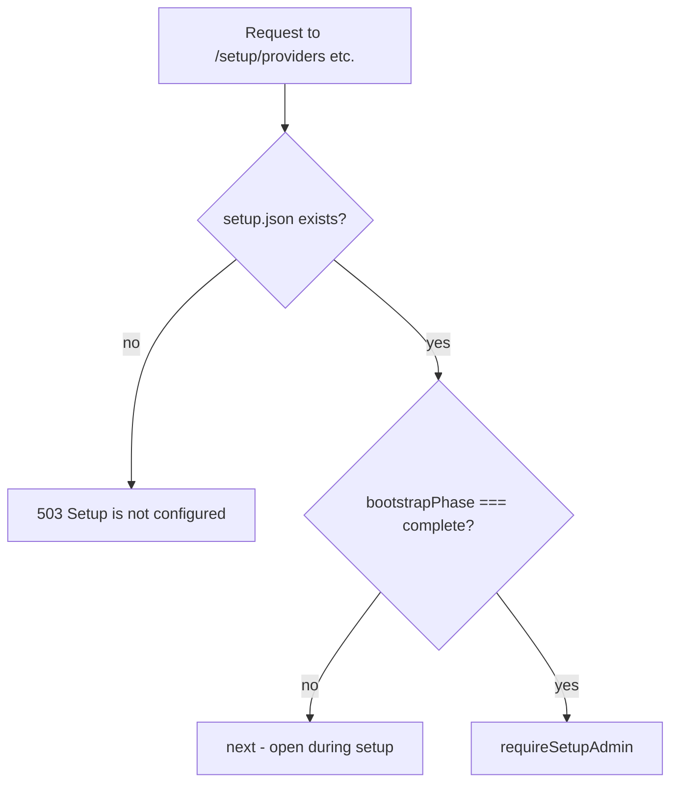
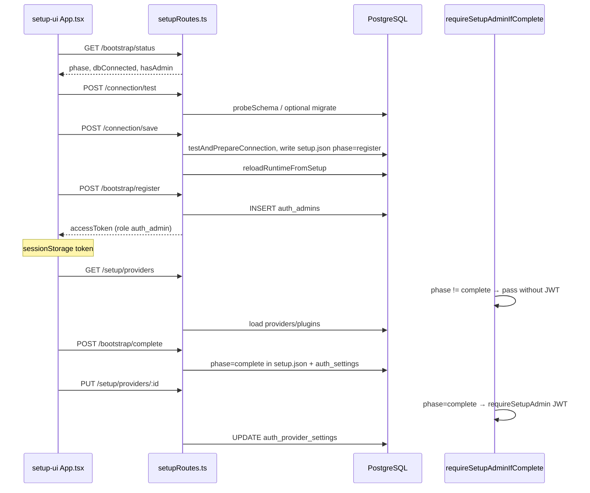

# Auth setup wizard & middleware — full flow (code map)

This document describes the **current** auth microservice bootstrap UI, API routes, **middleware conditions**, database tables, and **where each condition is implemented** in this repo.

Related: [REGISTER_TO_LOGIN_FLOW.md](./REGISTER_TO_LOGIN_FLOW.md) (product user login), [AUTH_SERVICE_A_TO_Z.md](./AUTH_SERVICE_A_TO_Z.md) (OAuth/plugins overview).

---

## 1. High-level architecture

```text
Browser (/setup)          Auth service (:5600)              Product PostgreSQL
     │                           │                                │
     │  GET /setup/bootstrap/status                             │
     │  POST /setup/connection/*  │── probe / migrate / save ───►│ auth_* tables
     │  POST /setup/bootstrap/*   │── auth_admins ───────────────►│ users, companies
     │  PUT /setup/providers/*    │── auth_provider_* ───────────►│
     │                           │                                │
     │  (later) POST /auth/product/login ─────────────────────────►│ users.password
```

**State on disk:** `.runtime/setup.json` (connection URL, `companyId`, `bootstrapPhase`).

**State in DB:** `auth_settings` key `bootstrap` mirrors phase (see `setupStore.ts`).

**In-memory after startup:** plugins + provider settings loaded via `runtimeSync.ts` → `reloadRuntimeFromSetup()`.

---

## Step 1 — Connect database to backend (Setup page 1)

This is the **first wizard screen**. It does **not** write to `poms-backend`; it connects the **auth microservice** to **your PostgreSQL** and saves the URL on the auth server.

### 1.1 UI → API → backend (call chain)

| Step | What happens | File (line) |
|------|----------------|---------------|
| 1 | User sees Step 1 when `App.tsx` sets `showConnection` | `setup-ui/src/App.tsx` (36–37, 87) |
| 2 | Form: host/port/user **or** full URL + `dbMode` | `setup-ui/src/components/ConnectionStep.tsx` (12–38, 70–196) |
| 3 | **Test connection** → `POST /setup/connection/test` | `ConnectionStep.tsx` `runTest` (41–51) → `setup-ui/src/api/setupApi.ts` (24–30) |
| 4 | **Save & continue** → `POST /setup/connection/save` | `ConnectionStep.tsx` `runSave` (54–64) → `setupApi.ts` (33–43) |
| 5 | Express route handlers | `src/setupRoutes.ts` (62–85 test, 87–109 save) |
| 6 | Build connection string | `src/bootstrapDb.ts` `buildDatabaseUrl` (23–42) |
| 7 | Check tables / migrate / company / provider tables | `src/bootstrapDb.ts` `testAndPrepareConnection` (153–191) |
| 8 | **Save only:** write config + reload plugins | `src/setupStore.ts` `writeSetupConfig` (37–49) → `src/runtimeSync.ts` (6–12) |

```text
ConnectionStep.tsx
    testConnection() / saveConnection()     [setup-ui/src/api/setupApi.ts]
        POST /setup/connection/test|save    [src/setupRoutes.ts]
            buildDatabaseUrl()              [src/bootstrapDb.ts]
            probeSchema()                   [src/bootstrapDb.ts]
            runBootstrapMigration()         [src/bootstrapDb.ts] → SQL file below
            ensureDefaultCompany()          [src/bootstrapDb.ts] + [src/companyIdType.ts]
            ensureAuthSetupTables()         [src/productDbConfig.ts]
        writeSetupConfig()                  [src/setupStore.ts]  → .runtime/setup.json
        reloadRuntimeFromSetup()            [src/runtimeSync.ts] (save only)
```

### 1.2 Where the DB connection is stored (backend link)

| Storage | Path / key | When written |
|---------|------------|--------------|
| **Auth service runtime (main)** | `auth-microservice-prototype/.runtime/setup.json` → `databaseUrl`, `companyId`, `dbMode`, `bootstrapPhase` | **Save & continue** (`setupRoutes.ts` 92–97) |
| **Same DB (mirror)** | Table `auth_settings`, key `bootstrap` + `db_mode` | `writeSetupConfig` / `setAuthSetting` (`setupStore.ts`, `bootstrapDb.ts`) |
| **Not on Step 1 UI** | Auth `.env` `DATABASE_URL` is optional/commented; wizard URL overrides | Peppers/JWT stay in `.env` only |

After save, **every** backend DB call uses `loadSetupConfigHydrated().databaseUrl` (`setupStore.ts` 65–72) — not a hard-coded env URL.

**Startup:** `src/index.ts` (11–12) calls `reloadRuntimeFromSetup()` which reads `setup.json` and connects to that DB.

### 1.3 Migration script location

| What | Path |
|------|------|
| **SQL file (auth tables)** | `auth-microservice-prototype/scripts/migrations/001-auth-bootstrap.sql` |
| **Runner** | `bootstrapDb.ts` → `runSqlFile(pool, '001-auth-bootstrap.sql')` (79–83) |
| **Called from** | `runBootstrapMigration()` (85–91) inside `testAndPrepareConnection()` when tables are missing (169–171) |

**`001-auth-bootstrap.sql` creates:** `auth_settings`, `auth_admins`.

**Created in TypeScript (not in that SQL file):**

| Tables | Code |
|--------|------|
| `companies` (if missing) | `src/companyIdType.ts` `ensureCompaniesTable` |
| `auth_provider_plugins`, `auth_provider_settings` | `src/productDbConfig.ts` `createAuthProviderTables` / repair |

### 1.4 Test vs Save — different behavior

| Button | API | Migrates? | Writes `setup.json`? | Reloads runtime? |
|--------|-----|-----------|----------------------|------------------|
| **Test connection** | `POST /setup/connection/test` | Only if `probeSchema` finds **missing** tables | **No** | **No** |
| **Save & continue** | `POST /setup/connection/save` | Always runs `testAndPrepareConnection(..., { migrate: true })` | **Yes** (`bootstrapPhase: register`) | **Yes** |

**Test path logic** (`setupRoutes.ts` 62–85):

1. `buildDatabaseUrl` → if invalid host/user/database → **400** (see failures below).
2. `probeSchema` → `SELECT 1` on DB.
3. If all required tables exist → **200** `"All required tables exist"` (may include **warnings**, not errors).
4. If tables missing → runs full `testAndPrepareConnection` (migrate + company + provider tables) → **200** `"Schema migrated"`.

**Save path logic** (`setupRoutes.ts` 87–109):

1. Always `testAndPrepareConnection` (migrate if needed + company + provider tables).
2. `writeSetupConfig` + `reloadRuntimeFromSetup`.
3. On success → **200** + move UI to Step 2 (`onSaved` → refresh bootstrap status).

### 1.5 Required tables checked (`probeSchema`)

**File:** `src/bootstrapDb.ts` (20–21, 53–76)

| `dbMode` | Must exist in `public` schema |
|----------|-------------------------------|
| `product` | `auth_settings`, `auth_admins`, `auth_provider_plugins`, `auth_provider_settings`, **`companies`** |
| `auth_only` | same auth tables + **`companies`** |

**Warning only (Test/Save still succeed):** `companies` exists but **`users`** missing → message in `warnings[]` (line 69–70).

### 1.6 Setup page 1 — failure conditions (what you see)

All API errors return **`{ "error": "<message>" }`** with HTTP **400** unless noted.  
UI shows a **toast** via `toastFromError` (`ConnectionStep.tsx` 48, 61).

| # | Condition | Typical `error` message | Where thrown / handled |
|---|-----------|-------------------------|-------------------------|
| 1 | Missing host/user/database (not using URL mode) | `Provide databaseUrl or host, user, and database name` | `buildDatabaseUrl` `bootstrapDb.ts` 30–31 |
| 2 | Wrong password / host / firewall / SSL | PostgreSQL driver message (e.g. `password authentication failed`, `ECONNREFUSED`) | `pool.query('SELECT 1')` in `probeSchema` → caught `setupRoutes.ts` 81–83 |
| 3 | Invalid connection URL | Driver parse / connection error | same |
| 4 | Migration SQL fails | SQL error text | `runSqlFile` / `runBootstrapMigration` |
| 5 | Tables still missing after migration | `Migration completed but tables still missing: ...` | `testAndPrepareConnection` `bootstrapDb.ts` 173–175 |
| 6 | `companies.id` type vs `auth_provider_*.company_id` mismatch (with data) | Message about wrong type + DROP hint | `productDbConfig.ts` `recreateAuthProviderTables` / repair |
| 7 | Insert default company fails (e.g. `updated_at` NOT NULL) | Postgres constraint message | `ensureDefaultCompany` `bootstrapDb.ts` 103–106 |
| 8 | FK / schema repair fails and fallback fails | Various | `ensureAuthSetupTables` `productDbConfig.ts` |
| 9 | Save: `reloadRuntimeFromSetup` fails after config written | Error from `getBootstrapFromProductDb` | `setupRoutes.ts` 98 — rare; config may already be on disk |
| 10 | Network: auth service down | Browser / fetch error | `setupApi.ts` `parseJson` — not JSON body |

**UI behavior on failure:**

| Button | On error |
|--------|----------|
| Test | Toast **"Connection failed"** + server `error` text; **stay on Step 1** |
| Save | Toast **"Save failed"** + server `error` text; **stay on Step 1**; `setup.json` **not** updated if save handler threw before `writeSetupConfig` |

**UI behavior on success:**

| Button | On success |
|--------|------------|
| Test | Green toast with `message` (+ `warnings` appended in UI if any) |
| Save | Green toast + `onSaved()` → `App.tsx` `refresh()` → Step 2 **Register admin** if `phase === 'register'` |

### 1.7 Quick debug checklist (Step 1)

1. Auth service running: `npm run dev` in `auth-microservice-prototype` (port **5600**).
2. Open `http://localhost:5600/setup` — UI must be built (`npm run build` includes `build:setup-ui`).
3. Azure/hosted DB: enable **Require SSL** or `?sslmode=require` in URL (`ConnectionStep.tsx` 154–161).
4. After successful **Save**, confirm file exists: `.runtime/setup.json` with `databaseUrl` and `companyId`.
5. If provider table type wrong from old run: see [§15 Reset](#15-reset--troubleshooting) or let auto-repair run on save (`productDbConfig.ts`).

---

## 2. Bootstrap phases

| Phase | Meaning | Stored in |
|-------|---------|-----------|
| `connection` | No DB saved yet (or UI forcing step 1) | `setup.json` / default |
| `register` | DB saved; first setup admin not created | `setup.json` after save |
| `setup` | Admin exists; configuring providers | after `POST /setup/bootstrap/register` |
| `complete` | Wizard finished; provider APIs need admin JWT | after `POST /setup/bootstrap/complete` |

**Type:** `BootstrapPhase` in `src/setupStore.ts` (lines 5–15).

**Phase resolution for UI:** `getBootstrapStatus()` in `src/bootstrapService.ts` (lines 13–48):

| Condition | Effect on `phase` returned to UI |
|-----------|----------------------------------|
| No `setup.json` | `connection`, `dbConnected: false` |
| `bootstrapPhase === 'connection'` but DB URL exists | If `auth_admins` count > 0 → `setup`, else → `register` |
| No admin but phase is `setup` or `complete` | Forced back to `register` |
| `setupComplete` | `true` when `bootstrapPhase === 'complete'` |

---

## 3. Setup UI — which screen shows when

**File:** `setup-ui/src/App.tsx`

On load: `fetchBootstrapStatus()` → `GET /setup/bootstrap/status` (`setup-ui/src/api/setupApi.ts` lines 19–22).

| UI screen | Condition (lines 36–40) | Component |
|-----------|-------------------------|-----------|
| **Connection** | `!status.dbConnected` **or** `phase === 'connection'` | `ConnectionStep.tsx` |
| **Register admin** | `dbConnected && phase === 'register' && !hasToken` | `RegisterStep.tsx` |
| **Admin login** | `dbConnected && hasAdmin && !hasToken && !showRegister` | `LoginPage.tsx` |
| **Providers** | `dbConnected && hasToken` | `ProvidersStep.tsx` |

`hasToken` = `sessionStorage` key `auth_setup_admin_token` (`setup-ui/src/utils/authSession.ts`).

**Logout** visible only on providers step (`showLogout={showProviders}`, line 79).

---

## 4. Setup API routes & conditions

**Router mount:** `src/index.ts` line 18 — `app.use('/setup', setupRouter)`.

**Router file:** `src/setupRoutes.ts`.

### 4.1 Public (no admin middleware)

| Method | Path | Purpose | Main conditions | Code |
|--------|------|---------|-----------------|------|
| GET | `/setup/bootstrap/status` | UI state | Always | `setupRoutes.ts` 42–45 → `bootstrapService.ts` |
| GET | `/setup/state` | Legacy/config dump | `loadSetupConfigHydrated()` | 47–59 |
| POST | `/setup/connection/test` | Test DB | `buildDatabaseUrl`; if tables missing → `testAndPrepareConnection` migrate | 62–85 |
| POST | `/setup/connection/save` | Save DB + phase `register` | Same prepare; `writeSetupConfig`; `reloadRuntimeFromSetup` | 87–109 |
| POST | `/setup/bootstrap/register` | First admin | `CLIENT_HASH_HEX`; `registerAdmin` | 112–140 |
| POST | `/setup/admin/login` | Admin login | `CLIENT_HASH_HEX`; `loginAdmin` | 143–160 |
| POST | `/setup/bootstrap/complete` | Lock wizard | `setup` must exist | 163–179 |

**Client hash rule (setup + product):** `/^[a-f0-9]{64}$/i` — `setupRoutes.ts` line 23.

### 4.2 Protected by `requireSetupAdminIfComplete`

**Middleware file:** `src/setupAdminMiddleware.ts`

Applied to:

| Method | Path | Line in setupRoutes.ts |
|--------|------|------------------------|
| GET | `/setup/providers` | 182 |
| PUT | `/setup/providers/:provider` | 208 |
| POST | `/setup/plugins/upload` | 249 |
| DELETE | `/setup/plugins/:id` | 293 |
| POST | `/setup/reload` | 309 |

---

## 5. Setup middleware (detailed)

There are **two** middleware modules. Do not confuse them.

### 5.1 `requireSetupAdminIfComplete` — setup wizard API

**File:** `src/setupAdminMiddleware.ts` lines 40–55



### 5.2 `requireSetupAdmin` — strict admin JWT

**File:** `src/setupAdminMiddleware.ts` lines 8–37

| Step | Condition | HTTP | Line |
|------|-----------|------|------|
| 1 | No hydrated setup | 503 | 14–16 |
| 2 | No `Authorization: Bearer` | 401 Admin login required | 19–22 |
| 3 | JWT verify fails | 401 Invalid or expired | 34–35 |
| 4 | `claims.role !== 'auth_admin'` | 403 Admin access only | 28–30 |
| 5 | OK | `req.setupAdmin = claims` | 32–33 |

**Token issuer:** `adminAuth.ts` `issueAdminToken()` — role hard-coded `'auth_admin'` (lines 98–108).

**JWT secret:** `config.jwtSecretForProduct` from `JWT_SECRET` env (`config.ts` lines 45–46).

**Verifier:** `verifyProductSessionToken()` in `productJwt.ts` (same secret as product login JWT).

### 5.3 `requireBearer` — OAuth / prototype session

**File:** `src/middleware.ts` lines 7–19

Uses `verifyAccessToken()` from `tokens.ts` ( **`config.tokenSecret`** — OAuth/passkey tokens, **not** the same shape as product JWT).

**Used on:** e.g. `GET /auth/me`, passkey authenticated register — `routes.ts` (search `requireBearer`).

### 5.4 `requireInternalKey` — service-to-service

**File:** `src/middleware.ts` lines 22–32

| Condition | HTTP |
|-----------|------|
| `INTERNAL_API_KEY` not set | 503 |
| Header `x-internal-api-key` mismatch | 403 |

(Used where wired in routes; optional integration hook.)

### 5.5 CORS (not auth, but gates browser calls)

**File:** `src/cors.ts`

| Condition | Behavior |
|-----------|----------|
| `ALLOWED_ORIGINS` empty | Reflects any request `Origin` |
| Origin in list or `*` | Sets CORS headers |
| `OPTIONS` | 204, no body |

---

## 6. Connection & migration conditions

**File:** `src/bootstrapDb.ts`

### 6.1 `probeSchema(databaseUrl, dbMode)`

Required tables (lines 20–21, 53–76):

| `dbMode` | Required tables |
|----------|-----------------|
| `product` | `auth_settings`, `auth_admins`, `auth_provider_plugins`, `auth_provider_settings`, **`companies`** |
| `auth_only` | above auth tables + **`companies`** (created if missing) |

**Warning (not failure):** `companies` exists but `users` missing → warning string line 69–70.

### 6.2 `testAndPrepareConnection` (save + migrate path)

**File:** `src/bootstrapDb.ts` lines 154–191

| Step | Condition | Code |
|------|-----------|------|
| Build URL | `databaseUrl` **or** host+user+database | `buildDatabaseUrl` 23–42 |
| Migrate SQL | `!probe.tablesExist && migrate !== false` | `runBootstrapMigration` → `001-auth-bootstrap.sql` |
| Default company | Always | `ensureDefaultCompany` 95–111 |
| Align auth tables | Always after company | `ensureAuthSetupTables(databaseUrl, companyId)` |
| Persist mode | Always | `setAuthSetting(..., 'db_mode', dbMode)` |

**Company row:** `ensureDefaultCompany` — first `companies` row or INSERT with `created_at`/`updated_at` (lines 99–107).

**Provider table types:** `productDbConfig.ts` + `companyIdType.ts` (UUID vs TEXT `companies.id`).

### 6.3 Save connection side effects

**File:** `src/setupRoutes.ts` 87–98

| Action | Condition |
|--------|-----------|
| `bootstrapPhase: 'register'` | Always on successful save |
| `reloadRuntimeFromSetup()` | Loads plugins/settings from DB into memory |

---

## 7. Admin auth conditions

**File:** `src/adminAuth.ts`

### Register (`POST /setup/bootstrap/register`)

| Condition | Error | Lines |
|-----------|-------|-------|
| No setup / no DB URL | Database connection is not configured | 15–20 |
| `bootstrapPhase !== 'register'` | Admin registration is not available at this step | 28–30 |
| `countAdmins > 0` | An admin account already exists | 32–35 |
| Email exists in `auth_admins` | Email already registered | 39–44 |
| OK | Insert `auth_admins`; token `role: auth_admin` | 46–62 |

**Table:** `auth_admins` (pepper: `AUTH_ADMIN_PEPPER`, `config.ts` line 40).

### Login (`POST /setup/admin/login`)

| Condition | Error | Lines |
|-----------|-------|-------|
| No admin row | Invalid credentials | 80–81 |
| Password mismatch | Invalid credentials | 83–90 |
| OK | JWT with `auth_admin` | 92 |

After register, `setupRoutes.ts` sets phase to **`setup`** (lines 123–128).

---

## 8. Complete setup & post-complete behavior

**`POST /setup/bootstrap/complete`** (`setupRoutes.ts` 163–175)

| Condition | Result |
|-----------|--------|
| No setup file | 400 Setup connection not saved |
| OK | `bootstrapPhase: 'complete'`, `setupCompletedAt` ISO timestamp |

**After `complete`:**

- `requireSetupAdminIfComplete` → **requires** Bearer admin JWT on provider/plugin routes.
- UI still shows **Providers** if `hasToken`; otherwise **LoginPage** (`App.tsx` 38–39).

**Finish button:** `ProvidersStep.tsx` `finishSetup()` → `completeBootstrap()` (`setupApi.ts` 70–75) sends `authHeaders()` (Bearer).

---

## 9. Runtime reload (startup + after changes)

**File:** `src/runtimeSync.ts`

| Condition | Behavior |
|-----------|----------|
| No `setup.json` | Returns `false`, skip |
| OK | `getBootstrapFromProductDb` → load plugins + provider settings |

**Called from:**

- `src/index.ts` line 12 (startup — **failure exits process**)
- `setupRoutes.ts` after save provider, upload/delete plugin, `POST /setup/reload`

**Note:** `src/db.ts` is a **stub** (stateless); all SQL uses `pg.Pool` with `setup.databaseUrl`.

---

## 10. Product user auth (after setup — not setup middleware)

These routes use **`requireSetup()`** (setup file + DB), not setup admin middleware.

| Route | File | Gate |
|-------|------|------|
| `POST /auth/login` | `routes.ts` 57–87 | `setup` + `AUTH_USER_PEPPER` + `JWT_SECRET`; then `loginProductUser` |
| `POST /auth/register` | `routes.ts` 89–125 | same |
| `POST /auth/product/login` | `productAuthRoutes.ts` 52–67 | `requireSetup()` |
| `POST /auth/product/register` | `productAuthRoutes.ts` 70–91 | `requireSetup()` |
| `GET /auth/product/config` | `productAuthRoutes.ts` 22–40 | `productAuthReady` boolean |

**Product login table:** `users` (`productUserAuth.ts` lines 44–48).

**`requireSetup()`** (`productUserAuth.ts` 18–23): throws if no hydrated setup.

---

## 11. Database tables (who uses what)

| Table | Setup wizard | Product login |
|-------|--------------|---------------|
| `auth_settings` | `db_mode`, `bootstrap` JSON | — |
| `auth_admins` | Setup admin only | — |
| `auth_provider_settings` | Provider toggles / OAuth secrets | Runtime provider list |
| `auth_provider_plugins` | Uploaded manifests | OAuth/passkey adapters |
| `companies` | `companyId` tenant | `users.company_id` FK |
| `users` | (warn if missing) | Email/password login |

---

## 12. Environment variables (gates)

**File:** `src/config.ts`

| Variable | Used for |
|----------|----------|
| `JWT_SECRET` | Product JWT + **setup admin** JWT (`jwtSecretForProduct`) |
| `AUTH_ADMIN_PEPPER` | `auth_admins.password_hash` |
| `AUTH_USER_PEPPER` | `users.password` (falls back to `AUTH_PASSWORD_PEPPER`) |
| `ALLOWED_ORIGINS` | CORS for setup UI + product frontend |
| `PORT` | Default 5600 |
| `OAUTH_CALLBACK_BASE_URL` | OAuth redirect URIs |

---

## 13. File index (quick lookup)

| Concern | Path |
|---------|------|
| HTTP entry | `src/index.ts` |
| Setup API | `src/setupRoutes.ts` |
| Setup admin middleware | `src/setupAdminMiddleware.ts` |
| OAuth/passkey bearer middleware | `src/middleware.ts` |
| Bootstrap phase logic | `src/bootstrapService.ts`, `src/setupStore.ts` |
| DB probe / migrate | `src/bootstrapDb.ts` |
| Provider tables / FK repair | `src/productDbConfig.ts`, `src/companyIdType.ts` |
| SQL migration | `scripts/migrations/001-auth-bootstrap.sql` |
| Admin register/login | `src/adminAuth.ts` |
| Product user login | `src/productUserAuth.ts`, `src/productAuthRoutes.ts` |
| JWT (product + admin) | `src/productJwt.ts` |
| JWT (OAuth prototype) | `src/tokens.ts` |
| Runtime memory | `src/runtimeSync.ts`, `src/plugin/pluginRegistry.ts`, `src/providerSettings.ts` |
| Setup UI routing | `setup-ui/src/App.tsx` |
| Setup UI API client | `setup-ui/src/api/setupApi.ts` |
| Admin token in browser | `setup-ui/src/utils/authSession.ts` |
| UI steps | `setup-ui/src/components/ConnectionStep.tsx`, `RegisterStep.tsx`, `LoginPage.tsx`, `ProvidersStep.tsx` |
| Static UI mount | `src/setupUiStatic.ts` |

---

## 14. End-to-end wizard sequence



---

## 15. Reset / troubleshooting

| Goal | Action |
|------|--------|
| Re-run connection step | Delete or edit `.runtime/setup.json` (`bootstrapPhase: "connection"`) |
| Re-register setup admin | Clear `auth_admins` row(s); set phase `register` |
| Fix provider schema mismatch | Automatic repair in `productDbConfig.ts` (`repairAuthProviderCompanyIdType`) |
| UI stuck without token | `sessionStorage.removeItem('auth_setup_admin_token')` |

---

*Generated for the current `auth-microservice-prototype` tree. Update this doc when adding routes or changing `requireSetupAdminIfComplete` behavior.*
