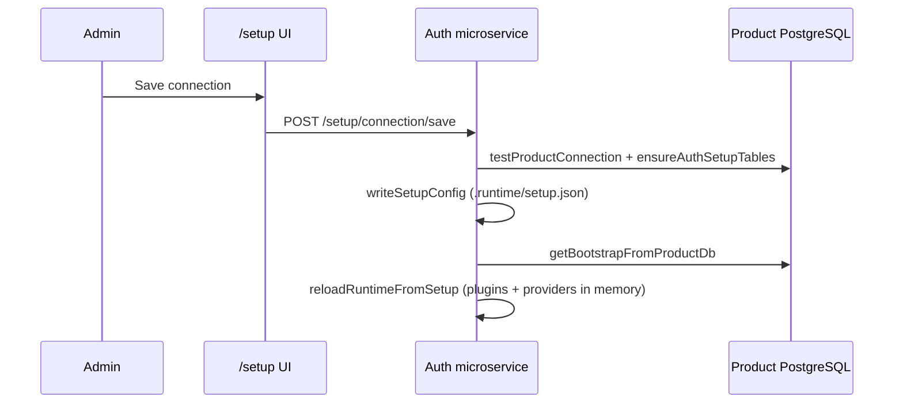
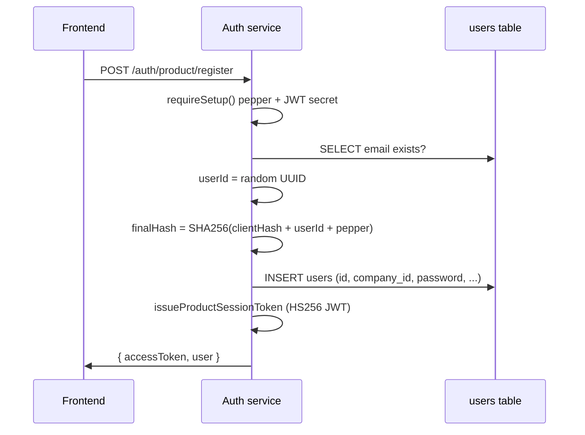
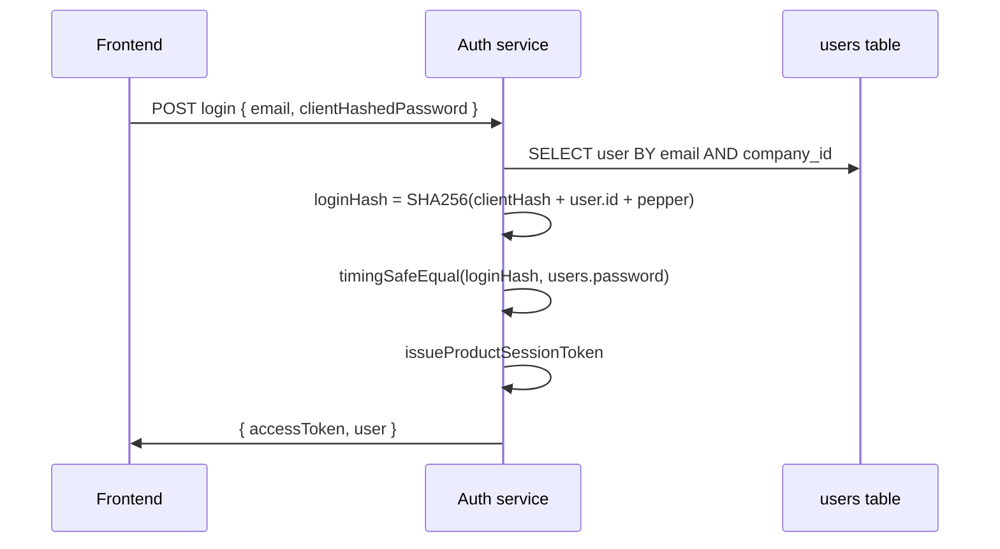
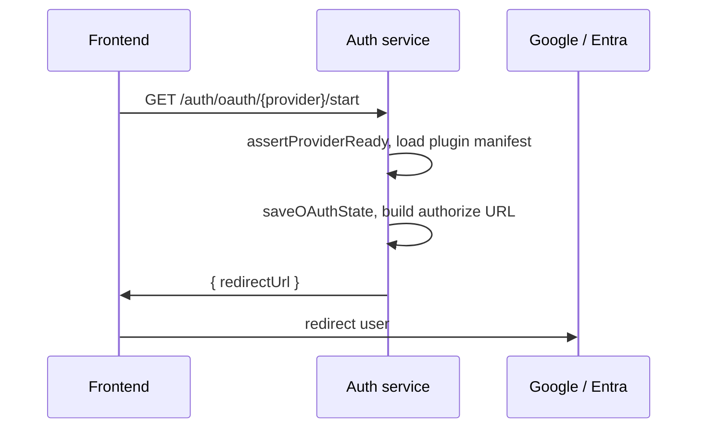

# Register → Login → Product API — Full Flow

This document explains **end-to-end** what happens from user registration through login, how the **auth microservice** talks to the **product database**, and why each step exists. It includes **file and line references** into this monorepo.

For the complete auth-service map (plugins, OAuth, setup), see [AUTH_SERVICE_A_TO_Z.md](./AUTH_SERVICE_A_TO_Z.md).

---

## Actors

| Actor | Role |
|-------|------|
| **Browser / product frontend** | Hashes plain password once (`SHA-256`), calls auth or product API |
| **Auth microservice** (`:5600`) | OAuth, provider list, password login; **bootstrap wizard** at `/setup` |
| **Setup admin** | First-run: DB connect → register at `/setup` → configure plugins (`auth_admins` table) |
| **Product backend** (e.g. POMS `:5000`) | Optional proxy; verifies JWT (`JWT_SECRET` = auth service env) |
| **Product PostgreSQL** | `users`, `companies`, `auth_provider_*`, `auth_admins` |

## Bootstrap wizard (before end-user login)

| Step | UI | Code |
|------|-----|------|
| DB connect | Connection only (no secrets in UI) | `setupRoutes.ts` `POST /setup/connection/save`, `bootstrapDb.ts` |
| Migrate | Auto on test/save | `scripts/migrations/001-auth-bootstrap.sql` |
| Admin register | Email + password | `POST /setup/bootstrap/register`, `adminAuth.ts` |
| Plugins | Providers step | `setup-ui` `ProvidersStep.tsx` |
| Finish | Hides connection forever | `POST /setup/bootstrap/complete` |
| Admin login | After finish | `POST /setup/admin/login` |

Peppers: `AUTH_ADMIN_PEPPER` (admin), `AUTH_USER_PEPPER` (product users) in `config.ts`.

---

## Two integration modes

### A — Minimal (frontend → auth service directly)

```text
Browser ──POST /auth/product/register|login──► Auth service ──SQL──► Product DB
Browser ──GET /api/... + Bearer JWT──────────► Product backend (verify JWT only)
```

### B — POMS proxy (frontend → product backend → auth service)

```text
Browser ──POST /api/auth/register|login──► POMS backend ──SQL──► Product DB
Browser ──OAuth──► POMS ──proxy──► Auth service ──IdP
```

Both use the **same password formula** and can issue the **same JWT shape** (`userId`, `companyId`, `email`, `role`).

---

## Password formula (why it looks this way)

Plain password **never** leaves the browser.

```text
clientHashedPassword = SHA256(plainPassword)     // browser
salt                 = users.id                  // UUID generated at register
finalHash            = SHA256(clientHashedPassword + salt + pepper)
```

| Piece | Why |
|-------|-----|
| Client hash | Network never sees plain password |
| `salt = userId` | Per-user salt without extra DB column |
| Pepper | Server secret; not in DB; configured in `/setup` or product `AUTH_PASSWORD_PEPPER` |

**Code (auth service):**

| Step | File | Lines |
|------|------|-------|
| Hash / compare | `auth-microservice-prototype/src/productPassword.ts` | 3–25 |
| Register insert | `auth-microservice-prototype/src/productUserAuth.ts` | 80–122 |
| Login verify | `auth-microservice-prototype/src/productUserAuth.ts` | 56–77 |

**Code (POMS product backend — same math):**

| Step | File | Lines |
|------|------|-------|
| Hash / compare | `poms-backend/src/utils/password.ts` | 25–42 |
| Register | `poms-backend/src/controllers/auth.controller.ts` | 236–248 |
| Login | `poms-backend/src/controllers/auth.controller.ts` | 343–348 |

---

## Phase 0 — One-time setup (before any user can register)

Admin opens **`http://localhost:5600/setup`**.



| Step | What | Code |
|------|------|------|
| 1 | Test DB + `companyId` exists in `companies` | `productDbConfig.ts` **24–32** |
| 2 | Create/migrate `auth_provider_plugins`, `auth_provider_settings` | `productDbConfig.ts` **35–122** |
| 3 | Save `databaseUrl`, `companyId`, pepper, JWT secret, CORS | `setupRoutes.ts` **224–254**, `setupStore.ts` **4–18** |
| 4 | Reload in-memory plugins/settings | `runtimeSync.ts` **6–12** |

Without **password pepper** + **product JWT secret** in setup, password register/login on the auth service returns **501** (`routes.ts` **59–68**, **91–94**).

---

## Phase 1 — Registration flow

### 1.1 User fills sign-up form (browser)

User enters name, email, phone, password, etc.

**POMS frontend** (`SignUpForm` or `authApi.register`):

| Step | File | Lines |
|------|------|-------|
| Hash password | `poms-frontend/src/utils/sha256.ts` | 1–6 |
| POST register | `poms-frontend/src/services/api/authApi.ts` | 45–73 |

```text
POST /api/auth/register   (proxy mode — POMS backend)
POST /auth/product/register   (minimal mode — auth service)
Body: { name, email, phone, role, clientHashedPassword }  // 64-char hex, NOT plain password
```

### 1.2 HTTP entry (auth service — minimal mode)

| Step | File | Lines |
|------|------|-------|
| Mount router | `index.ts` | 18 |
| Validate body | `productAuthRoutes.ts` | 75–81 |
| Create user + issue JWT | `productAuthRoutes.ts` | 83–91 |

Alias routes (same logic): `POST /auth/register` → `routes.ts` **87–124**.

### 1.3 Create user in product database



| Step | What | Code |
|------|------|------|
| Require setup | `productUserAuth.ts` | **17–30** |
| Duplicate email check | `productUserAuth.ts` | **90–96** |
| `userId` + `finalHash` | `productUserAuth.ts` | **98–103** |
| SQL INSERT | `productUserAuth.ts` | **105–118** |

**Important:** Auth-service register uses **`companyId` from `/setup`** only. It does **not** create a new `companies` row. POMS register **does** create company + user (`auth.controller.ts` **230–261**).

### 1.4 Issue session token (product JWT)

Auth service signs a **standard 3-part JWT** your product API already understands:

| Claim | Source |
|-------|--------|
| `userId` | `users.id` |
| `companyId` | `users.company_id` |
| `email`, `role` | user row |

| Step | File | Lines |
|------|------|-------|
| Build response | `productJwt.ts` | **64–88** |
| Sign JWT | `productJwt.ts` | **20–31** |

Secret = **Product JWT secret** from `/setup` (must match product `JWT_SECRET`).

### 1.5 POMS proxy register (optional path)

| Step | File | Lines |
|------|------|-------|
| Controller | `poms-backend/src/controllers/auth.controller.ts` | **201–290** |
| Issue tokens | same file | **264–276** |
| JWT util | `poms-backend/src/utils/jwt.ts` | **23–26** |

---

## Phase 2 — Login flow (after register)

### 2.1 User submits sign-in (browser)

| Step | File | Lines |
|------|------|-------|
| SHA-256 password | `poms-frontend/src/utils/sha256.ts` | 1–6 |
| API call | `poms-frontend/src/services/api/authApi.ts` | 9–21 |
| Redux saga | `poms-frontend/src/store/sagas/authSaga.ts` | 24–40 |
| Store token | `authSlice.ts` `loginSuccess` | 52–58 |

### 2.2 HTTP entry (auth service)

| Step | File | Lines |
|------|------|-------|
| `POST /auth/product/login` | `productAuthRoutes.ts` | **57–72** |
| Alias `POST /auth/login` | `routes.ts` | **56–85** |

### 2.3 Verify password against DB



| Step | File | Lines |
|------|------|-------|
| Load user | `productUserAuth.ts` | **36–54**, **61** |
| Active check | `productUserAuth.ts` | **65–66** |
| Compare hash | `productUserAuth.ts` | **68–75** |

### 2.4 POMS proxy login

| Step | File | Lines |
|------|------|-------|
| Load user + password | `auth.controller.ts` | **326–331** |
| Compare | `auth.controller.ts` | **343–348** |
| Issue JWT | `auth.controller.ts` | **355–367** |

---

## Phase 3 — Using the token on the product API

After login/register, the frontend stores `accessToken` (e.g. `localStorage`).

```text
GET /api/purchase-orders
Authorization: Bearer <accessToken>
```

| Step | File | Lines |
|------|------|-------|
| Attach header | `poms-frontend/src/services/api/client.ts` | (axios interceptor) |
| Verify JWT | `poms-backend/src/middleware/auth.ts` | **22–45** |
| `verifyAccessToken` | `poms-backend/src/utils/jwt.ts` | **41–46** |

**Why this works with auth-service login:** `productJwt.ts` issues the same claim shape POMS expects (`userId`, `companyId`, `email`, `role`) using the **same secret** configured in `/setup`.

---

## Phase 4 — OAuth login (alternative to password)

OAuth uses **two tokens**:

1. **Auth-service token** — after IdP callback (`tokens.ts`, 2-part HMAC token).
2. **Product JWT** — after `oauth/complete` (3-part JWT for your API).

### 4.1 Start OAuth



| Step | File | Lines |
|------|------|-------|
| Route | `routes.ts` | **127–149** |
| Start OAuth | `auth/authAdapter.ts` | **27–62** |
| Build authorize URL | `auth/oauthAdapter.ts` | **35–54** |
| Redirect URI | `plugin/oauthRedirectUri.ts` | **5–8** |

POMS proxy: `auth.controller.ts` start OAuth (see `getAuthProviders` / OAuth start handlers ~**30–90**).

### 4.2 IdP callback → auth service

| Step | File | Lines |
|------|------|-------|
| Callback route | `routes.ts` | **242–258** |
| Validate state, exchange code | `auth/authAdapter.ts` | **65–109** |
| Token exchange | `auth/oauthAdapter.ts` | **57–111** |
| User profile | `auth/oauthAdapter.ts` | **137–158** |
| Issue auth-service token | `auth/authAdapter.ts` | **94–99** |
| Redirect to frontend | `auth/authAdapter.ts` | **101–108** |

User lands on: `{FRONTEND_APP_URL}/oauth/callback?accessToken=...`

### 4.3 Exchange for product JWT

| Mode | Endpoint | Code |
|------|----------|------|
| Minimal | `POST /auth/product/oauth/complete` | `productAuthRoutes.ts` **99–126** |
| POMS proxy | `POST /api/auth/oauth/complete` | `auth.controller.ts` **100–176** |

Flow:

1. Verify **auth-service** token (`verifyAccessToken` — `tokens.ts` **40–64**).
2. Find `users` row by **email** in product DB.
3. Issue **product JWT** (`sessionResponseForUser` or POMS `generateAccessToken`).

**Why user must exist first:** OAuth proves identity at Google/etc., but authorization is your `users` table (role, company). No auto-provision in minimal mode (`productAuthRoutes.ts` **113–116**).

**POMS frontend callback:**

| Step | File | Lines |
|------|------|-------|
| Read `accessToken` from URL | `OAuthCallbackHandler.tsx` | **29–34** |
| Complete login | `OAuthCallbackHandler.tsx` | **41–47** |
| API | `authApi.ts` | **98–111** |

---

## End-to-end diagram (password, minimal mode)

```text
┌─────────────┐     SHA256(plain)      ┌──────────────────┐
│   Browser   │ ─────────────────────► │ Auth microservice │
└─────────────┘   clientHashedPassword └────────┬─────────┘
       │                                         │
       │  POST /auth/product/register|login      │ SQL
       │                                         ▼
       │                              ┌──────────────────┐
       │                              │  Product Postgres │
       │                              │  users.password   │
       │                              └──────────────────┘
       │◄──────── { accessToken } ────┘
       │
       │  Authorization: Bearer accessToken
       ▼
┌──────────────────┐
│ Product backend  │  verifyAccessToken (JWT_SECRET)
│ /api/* protected │
└──────────────────┘
```

---

## Quick code index (register + login)

| Topic | File | Lines |
|-------|------|-------|
| Client SHA-256 | `poms-frontend/src/utils/sha256.ts` | 1–6 |
| Frontend login API | `poms-frontend/src/services/api/authApi.ts` | 9–21, 45–73 |
| Auth register route | `productAuthRoutes.ts` | 75–96 |
| Auth login route | `productAuthRoutes.ts` | 57–72 |
| DB register | `productUserAuth.ts` | 80–122 |
| DB login | `productUserAuth.ts` | 56–77 |
| Product JWT | `productJwt.ts` | 20–88 |
| Setup save | `setupRoutes.ts` | 224–254 |
| POMS register | `poms-backend/.../auth.controller.ts` | 201–290 |
| POMS login | `poms-backend/.../auth.controller.ts` | 301–377 |
| Protect API routes | `poms-backend/src/middleware/auth.ts` | 22–45 |
| OAuth → product session | `productAuthRoutes.ts` | 99–126 |
| Password flow doc (POMS) | `poms-backend/PASSWORD_HASH_FLOW_DOCUMENTATION.md` | (full file) |

---

## Related docs

- [MINIMAL_PRODUCT_INTEGRATION.md](./MINIMAL_PRODUCT_INTEGRATION.md) — checklist for new products
- [AUTH_SERVICE_A_TO_Z.md](./AUTH_SERVICE_A_TO_Z.md) — plugins, setup, OAuth internals
- [../INTEGRATION.md](../INTEGRATION.md) — connect another app
